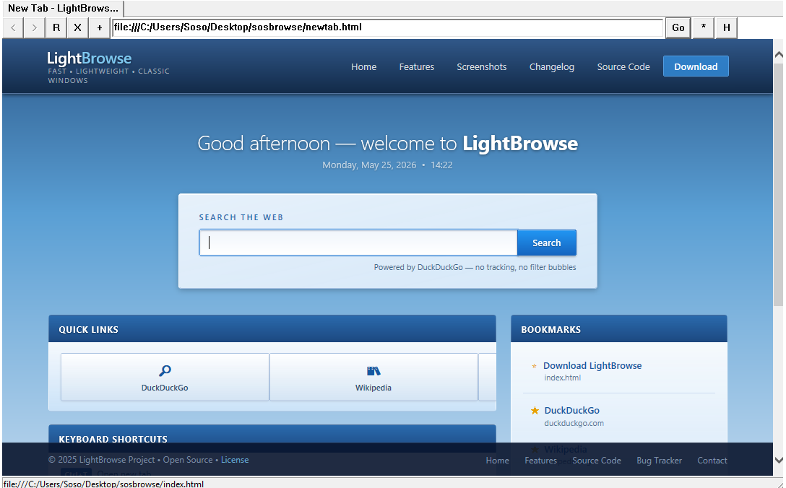
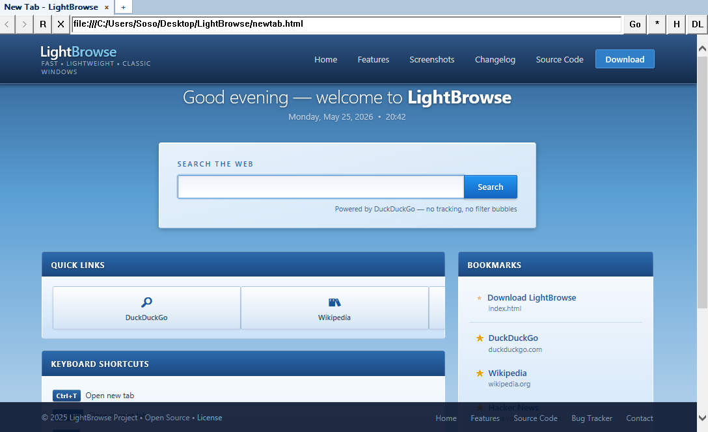

# Lightbrowse
A lightweignt browser built for old Windows versions (Using IE's engine)

# Download
Latest pre-release [here](https://github.com/flare-OS/lightbrowse/releases/tag/latest)

# Build from scratch
- Get [WinLibs](https://winlibs.com/?utm_source=lightbrowse-github)
- Add Winlibs to PATH ```setx PATH "%PATH%;C:\mingw64\bin" <-- change C:\mingw64\bin to where your extracted WinLibs install is```
- In the source directory run ```g++ browser.cpp -o browser.exe -lole32 -loleaut32 -luuid -lshlwapi -lcomctl32 -lcomdlg32 -lgdi32```

# First Version Screenshot


# Build 30 version screenshot

